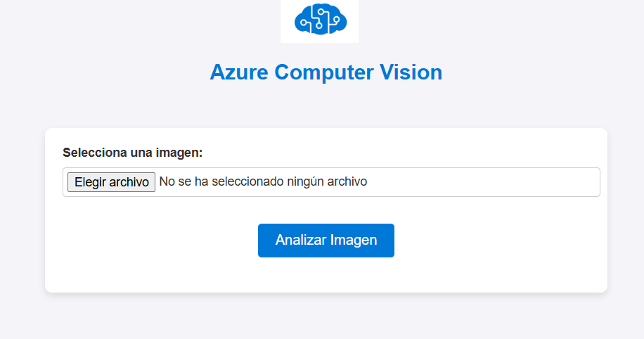
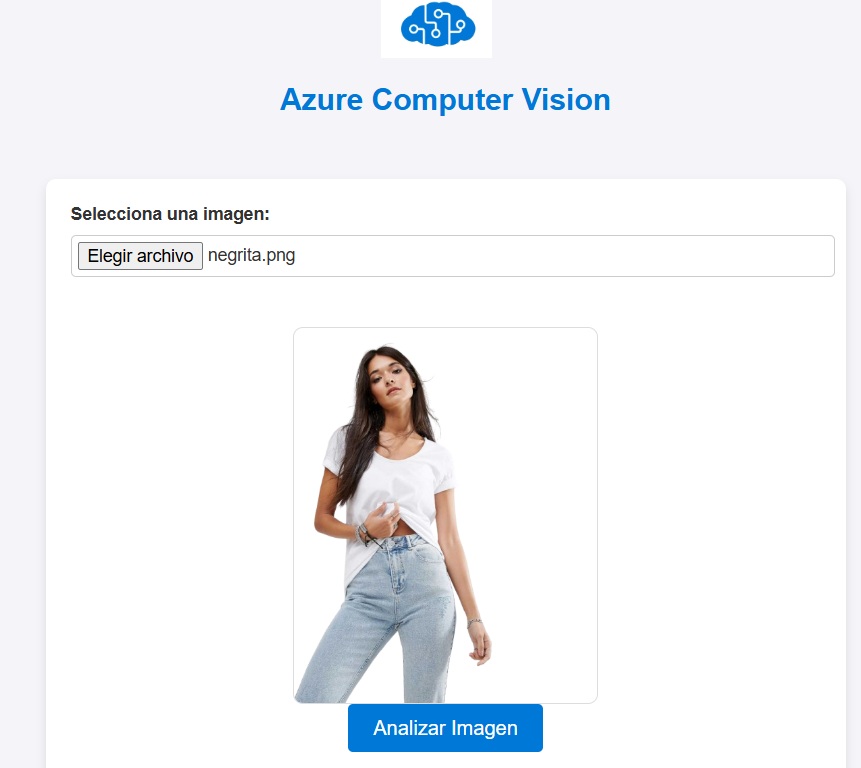
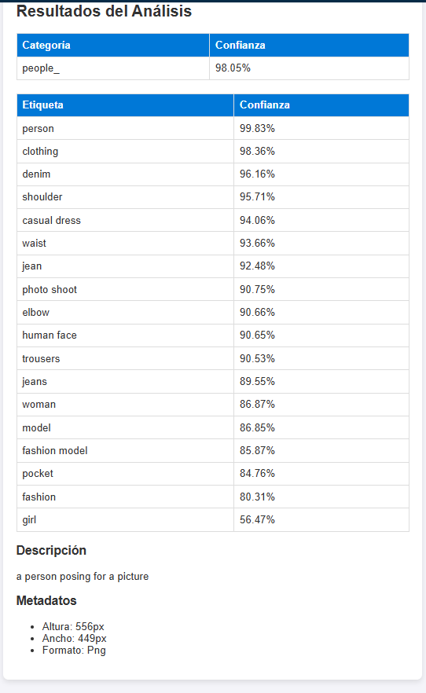

# Azure Computer Vision - Proyecto de Análisis de Imágenes

Este proyecto permite analizar imágenes utilizando el servicio **Azure Computer Vision**. Los usuarios pueden cargar imágenes desde una interfaz web y obtener resultados detallados como categorías, etiquetas, descripciones y metadatos.

---

## 🚀 **Características**

- **Frontend**: 
  - Interfaz intuitiva para cargar imágenes con vista previa en tiempo real.
  - Resultados organizados en una tabla clara y legible.

- **Backend**:
  - Servidor Node.js con Express que interactúa con Azure Cognitive Services.
  - Procesamiento de imágenes con integraciones avanzadas de Computer Vision.

- **Análisis avanzado**:
  - Generación de categorías y etiquetas con niveles de confianza.
  - Descripciones automáticas generadas por Azure.
  - Información de metadatos de la imagen (dimensiones, formato, etc.).

---

## 📋 **Requisitos**

1. **Node.js** (versión 14 o superior).
2. **Cuenta de Azure** con acceso a **Cognitive Services**.
3. Clave y Endpoint del servicio de **Azure Computer Vision**.

---

## ⚙️ **Configuración**

### 1️⃣ Clona este repositorio
```bash
git clone https://github.com/Jaider-Manosalva/Azure-Cognitive
cd tu-repo
```

### 2️⃣ Instala las dependencias
```bash
npm install
```

### 3️⃣ Configura las variables de entorno
Crea un archivo `.env` en la raíz del proyecto con el siguiente contenido:
```plaintext
AZURE_API_KEY=tu-clave-api
AZURE_ENDPOINT=https://tu-endpoint.cognitiveservices.azure.com/
```

### 4️⃣ Ejecuta el servidor
Inicia el servidor con:
```bash
node app.js
```

Accede a la aplicación en [http://localhost:3000](http://localhost:3000).

---

## 📁 **Estructura del Proyecto**

```plaintext
Tercer-parcial/
├── public/                   # Archivos estáticos del frontend
│   ├── azure-logo.png        # Logo de Azure
│   ├── index.html            # Página principal
│   ├── styles.css            # Estilos CSS
│   └── script.js             # Lógica de cliente
├── uploads/                  # Carpeta para imágenes subidas (temporal)
├── app.js                    # Servidor principal de Node.js
├── config/
│   └── azureConfig.js        # Configuración del servicio Azure
├── services/
│   └── computerVision.js     # Lógica para interactuar con Azure Computer Vision
├── utils/
│   └── fileHandler.js        # Funciones auxiliares para manejo de archivos
├── .env                      # Archivo de variables de entorno (no incluido en Git)
├── .gitignore                # Archivos ignorados por Git
└── package.json              # Configuración de dependencias
```

---

## 💻 **Uso**

1. **Subir una imagen**: Selecciona una imagen en la página principal.
2. **Vista previa**: Se mostrará la imagen seleccionada antes de enviarla.
3. **Analizar**: Presiona el botón "Analizar Imagen" para procesar la imagen con Azure.
4. **Resultados**: Los resultados aparecerán en tablas organizadas con categorías, etiquetas, descripciones y metadatos.

---

## 🌐 **Despliegue**

Este proyecto a sido desplegado en el servicio de:
- **Render** ([Render.com](https://Render.com))

### Pasos para Render:
1. Sube el proyecto a GitHub.
2. Conecta tu repositorio a Render.
3. Configura el comando de inicio:
   ```bash
   node app.js
   ```
4. Agrega las variables de entorno (`AZURE_API_KEY`, `AZURE_ENDPOINT`).
5. Render generará una URL pública para tu aplicación.

---

## 📸 **Capturas de Pantalla**

### Página Principal


### Vista Previa de Imagen


### Resultados del Análisis


---

## 🛠️ **Tecnologías Utilizadas**

- **Frontend**: HTML5, CSS3, JavaScript.
- **Backend**: Node.js, Express.js.
- **Cloud Services**: Azure Cognitive Services (Computer Vision).

---

## 📜 **Licencia**

Este proyecto está bajo la licencia [MIT](LICENSE). Puedes usarlo, modificarlo y distribuirlo según tus necesidades.

---

## ✉️ **Contacto**

Si tienes preguntas o sugerencias, no dudes en contactarme:
- **Email**: [jjaidermanosalva@unicesar.edu.co](jjaidermanosalva@unicesar.edu.co)
- **GitHub**: [https://github.com/Jaider-Manosalva](https://github.com/Jaider-Manosalva)
